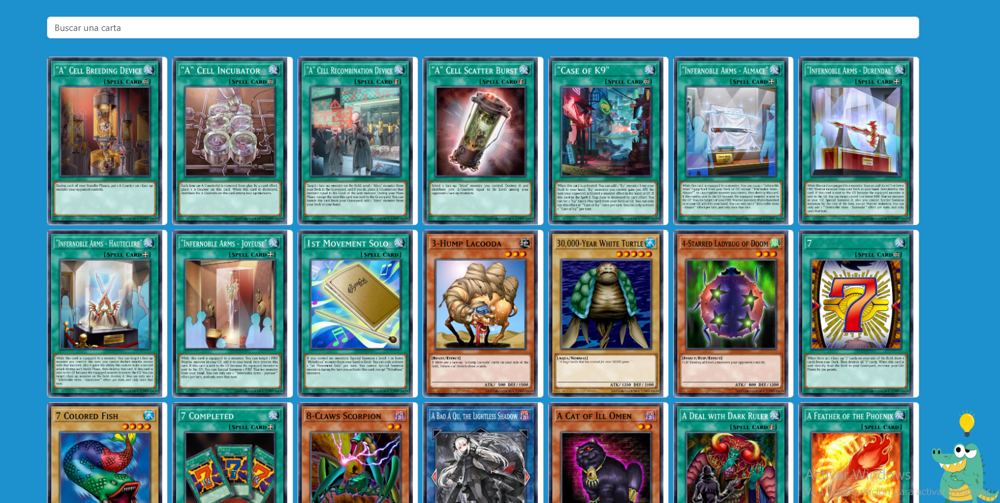
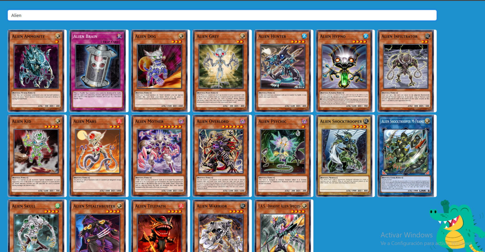

# Proyecto Final de Angular - Codigo Facilito

🃏 Proyecto Angular – Consumo de API YGOProDeck

Este proyecto en Angular consume la API pública de YGOProDeck, mostrando una lista de cartas de Yu-Gi-Oh!.

✨ Funcionalidades:
🔍 Búsqueda de cartas por nombre o palabra clave.

📄 Visualización detallada de una carta seleccionada mediante su ID.

🔁 Carga de cartas con scroll infinito: se cargan 100 cartas por vez al hacer scroll hacia abajo.

🌐 Consumo de la API:
https://db.ygoprodeck.com/api/v7/cardinfo.php?num=100&offset=...

## Listado de cartas

## Detalle de una carta

## Buscador

